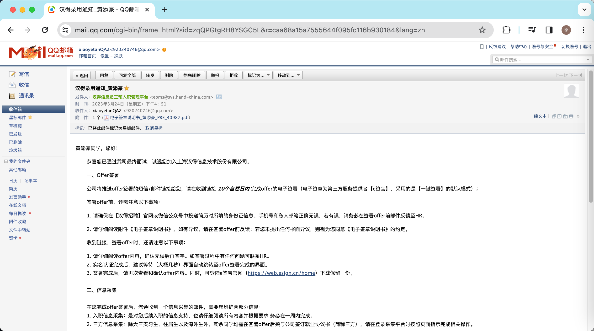

### 欢迎面试官来看我的简历，感谢您的时间 ~~~愿你我都生活的高手

## 技术栈

了解Java基础，了解线程池和异步任务编排的使用方法。对线程池参数有一定的了解，了解JVM内存模型和垃圾回收机制。

了解SSM和SpringBoot框架，如Spring中Bean的加载流程、SpringMVC中请求的执行流程、SpringBoot的启动流程、自动配置原理等。

了解MySQL，如索引、锁机制、事务隔离级别等，能够使用explain优化慢SQL。

了解Redis常见数据结构及使用场景、了解缓存一致性的解决方案、了解Redisson常见锁的使用场景，如读写锁、互斥锁。

了解RabbitMQ的常见使用场景和常用解决方案，如死信队列、消息顺序消费、避免消息重复消费等。

能够独立开发微服务模块，熟悉微服务常用组件的使用，如注册发现、配置管理、网关路由、RPC/HTTP远程调用等。

平常写代码遵循阿里开发规范，熟悉前后端分离的开发模式，能快速适应团队的协作方式和开发规范。

熟练使用chatGPT、通义灵码等AI工具提升工作效率。

## 工作经历

深圳东万科技有限公司	Java开发	2022.12~2023.12

桂林未来旅行信息科技有限公司	Java开发实习生	2021.05~2021.08 实习

广西航天信息技术有限公司	Java开发实习生	2020.10~2021.04实习
## 项目经历

#### 2023.07-2023.12 Mana Mart便利店app	管理端地址 https://shop.thebotle.com/#/dashboard

项目简介：这是一个马来西亚的连锁商店的线上购物app，可以提供外送服务，也可以在app上购买后根据二维码到线下自提。我在这个项目中主要负责了优惠券、促销活动、订单的优惠结算、用户任务、用户积分等相关模块或功能。

1. 对接马来西亚的官方电子支付系统payNet的api为ManaMart提供充值、支付的能力。
2. 对接LalaMove(货拉拉在马来西亚的业务)的api为ManaMart提供配送商品的能力，使用**RabbitMQ的死信队列**提高了下单接口的可靠性。
3. 使用**布隆过滤器**降低了商品点赞接口对数据库的压力。
4. 使用**RabbitMQ+Redisson读写锁**实现兑换优惠券，并保证了兑换优惠券接口的幂等性。
5. 通过将促销日和促销参与门店字段的数据类型从Varchar改为json，提升查询效率，进而减少订单优惠结算接口的响应时间。
6. 使用公私钥匙对保证用于线下兑换积分奖品的二维码不被盗刷。
7. 设计并实现了用户签到、任务、促销活动，如用户购买xx金额x次、购买xx产品xx次、给xx商品点赞、指定全场、分类、品牌、某商品进行促销的满减、折扣、特价活动。

#### 2022.12-2023.07 慧答 内部的答题平台

这是一个用于慧成新能源公司内部提升员工知识和技能的集交流社区和答题平台于一体项目，能够有效提升生产效率，降低培训成本，创造良好的学习氛围。包含移动端供员工交流答题，后台管理端供管理人员出题判题等。

1. 在项目初期使用阿里的云原生应用脚手架快速确定SpringBoot、SpringCloud以及SpringCloudAlibaba的版本，避免项目后期出现框架版本不兼容的情况。
2. 使用Mybatis-Plus+MybatisX-Generator快速生成题目、分类、标签、用户等部分的crud的代码，从而提高开发效率。
3. 为了降低代码的耦合度使用了**工厂+策略**模式实现新增题目、答题、题目详情等功能，从而提高代码的可扩展性。
4. 选用SaToken替代传统的权限框架，提高了开发的效率。
5. 自建minio做为文件存储服务器，从而进一步降低培训成本。
6. 采用SpringCloud Gateway+Redis实现**统一鉴权**以及分布式会话共享，在网关层实现统一的**全局异常处理**。
7. 为了提高项目的安全性，我们进行了内网部署，使得外网无法访问，只能通过内网访问，从而避免了外部人员对题库的爆破。
8. 独立从0到1使用docker搭建项目使用到的中间件，如Minio、Nacos、Redis等。

#### 2021.05-2021.08 金天下旅游地接系统-订单模块

在这段实习期间，我参与了公司地接系统订单模块的数据汇总报表统计开发工作。这个项目是一个集团对旗下旅行社管理的重要工具，类似于一个OA系统，用于提高旅行社的管理效率和业务处理能力。

1. 我参与了多个报表统计接口的开发，使用了开源工具jxls来导出数据到Excel中，并实现了两种展现方式：网页和Excel。
2. 我参与了集团季度业绩比赛的数据统计接口开发，该接口包括当前季度各旅行社的收客人数汇总、毛利汇总以及收款进度等数据。
3. 我使用了Mybatis的分步查询优化连表的方式，从而大幅提升了查询接口的响应时间。

#### 2020.10-2021.04 易用智多星ERP-车辆管理模块

在这段实习中我使用SpringBoot参与了开发了公司的易用智多星系统（OA系统）中车辆管理、建议箱模块功能的开发。

## 其他想说的

在春招时几乎第一批拿到汉得的offer（上市公司）

