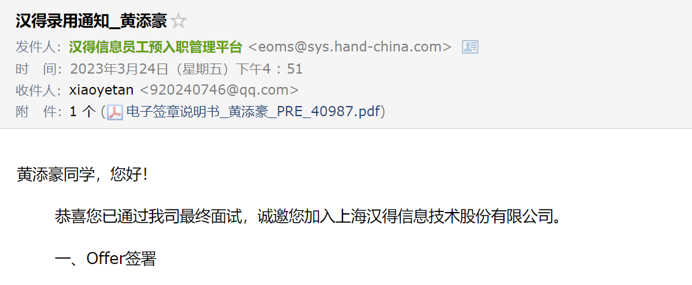
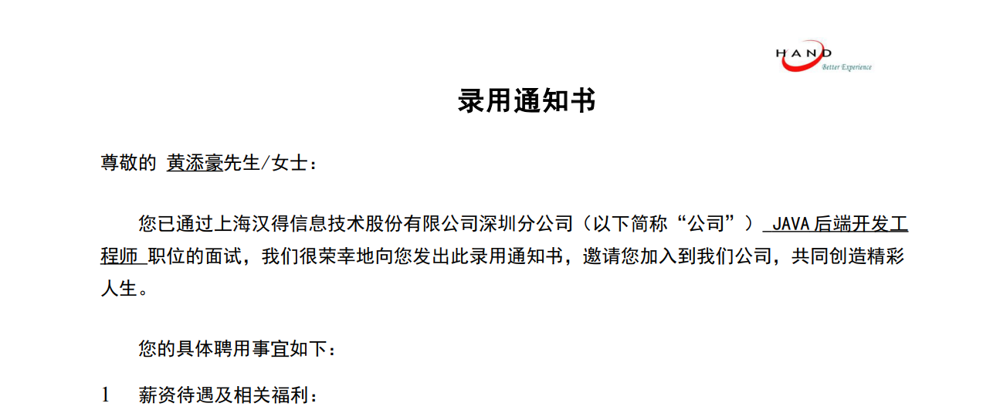
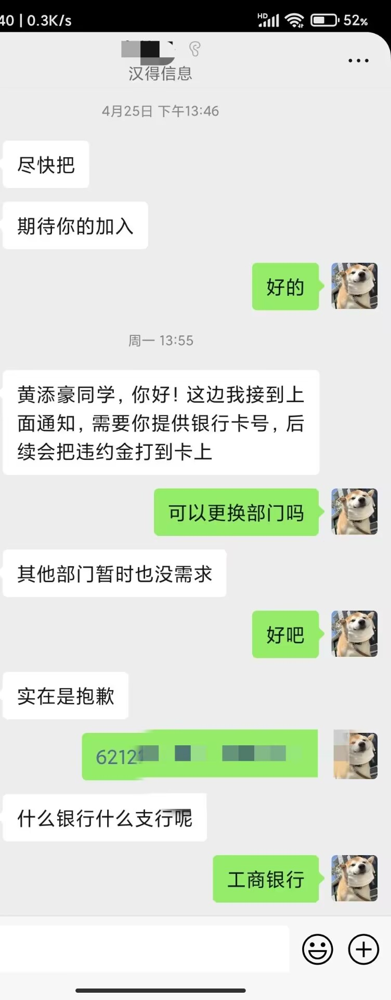

### 欢迎面试官来看我的简历，感谢您的时间 ~~~愿你我都生活的高手

## 我想说的话

简历绝对真实毫无半点包装、做假，一个应届生哪会有什么很亮眼的项目经历呢。我的优点就是有真实项目经验，熟悉开发流程，不会被应届生/培训杀手(git、maven)卡半天。

真诚才是必杀技~~~！

4月拿了上海某上市公司的offer，后因公司原因被解约（下面有写）

## 技术栈

力扣180+题，熟悉开发中常用的数据结构，比如数组，List，Map，链表等。

熟悉Java基础，如集合、Java8的新特性，可以在开发中熟练使用Stream、Lambda提升开发效率。

熟悉MySQL，如索引、事务隔离级别等。可以使用explain对SQL语句进行分析、优化。

能够使用Spring Cloud Alibaba进行开发，会用Nacos、Open Feign等微服务组件。

了解Redis的基本使用，如基本的数据类型、实现Session共享、解决缓存穿透、击穿等。

熟悉Git、Maven等项目管理工具，有良好的commit、code习惯。

## 项目

**桂林未来旅行信息科技有限公司	2021.05-2021.08**

**项目简介：**在这段实习期间，我参与了公司地接系统订单模块的数据汇总报表统计开发工作。该项目用于集团对旗下旅行社的管理，类似于一个OA系统。

**负责工作：**

1. 我参与了多个报表统计接口的开发，使用了开源工具jxls来导出数据到Excel中，并实现了两种展现方式：网页和Excel。

2. 我参与了集团季度业绩比赛的数据统计接口开发，该接口包括当前季度各旅行社的收客人数汇总、毛利汇总以及收款进度等数据。

3. 我使用了Mybatis的分步查询优化连表的方式，从而大幅提升了查询接口的响应时间。

**广西航天信息技术有限公司	2020.10-2021.04**

在这段实习中我参与了公司的易用智多星系统（OA系统）业务开发。

负责系统的车辆管理、建议箱模块功能的开发。

使用到的技术栈：SpringBoot+MyBatis+Vue

## 实习

**桂林未来旅行信息科技有限公司	Java开发实习生	2021.05-2021.08**

**广西航天信息技术有限公司	Java开发实习生	2020.10-2021.04**

## 春招的Offer

**因公司原因被解约**

